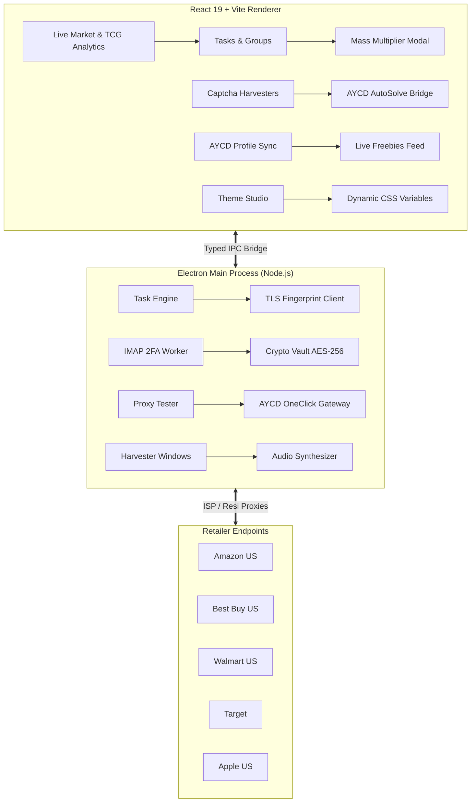

# ⬛ Blank — Next-Gen Desktop Retail Automation Suite

<p align="center">
  
</p>

<p align="center">
  <b>High-speed, protocol-level retail automation suite designed for limited drops, restocks, and pricing error glitch sniping.</b>
</p>

<p align="center">
  <a href="https://github.com/AqibMiah000/Blank-Bot"></a>
  <a href="https://github.com/AqibMiah000/Blank-Bot"></a>
  <a href="https://github.com/AqibMiah000/Blank-Bot"></a>
  <a href="https://github.com/AqibMiah000/Blank-Bot"></a>
  <a href="https://github.com/AqibMiah000/Blank-Bot"></a>
  <a href="LICENSE"></a>
</p>

---

### 📦 Direct Downloads (v1.30 Release)

| Platform | Format | Direct Download |
| :--- | :--- | :--- |
| **Windows (x64)** | `.zip` (Portable) | [Download Blank-v1.30-Windows-x64.zip](https://github.com/AqibMiah000/Blank-Bot/releases/download/v1.30/Blank-v1.30-Windows-x64.zip) |
| **macOS (Apple Silicon)** | `.dmg` (Installer) | [Download Blank-1.30.0-arm64.dmg](https://github.com/AqibMiah000/Blank-Bot/releases/download/v1.30/Blank-1.30.0-arm64.dmg) |
| **macOS (Apple Silicon)** | `.zip` (Portable) | [Download Blank-1.30.0-arm64-mac.zip](https://github.com/AqibMiah000/Blank-Bot/releases/download/v1.30/Blank-1.30.0-arm64-mac.zip) |

---

> 🚀 **New to retail automation?** Read the comprehensive, step-by-step **[Beginner's Walkthrough & Setup Guide (WALKTHROUGH.md)](WALKTHROUGH.md)** to configure your first drop in under 3 minutes.

---

## ⚡ Key Capabilities

| Feature | Description | Status |
| :--- | :--- | :---: |
| **24/7 TCG Drop Radar & Sentinel** | Real-time 24/7 inventory scanner tracking Pokémon (*Chaos Rising*, *Destined Rivals*, *Journey Together*, *Prismatic Evolutions*, *151*) and One Piece (*OP-10*) across Best Buy, Target, Walmart, and Amazon. | ⚡ v1.30 |
| **Target & Walmart Local Shelf Radar** | Scans Target and Walmart branches within 10–50 mi by City, State & ZIP with exact street addresses and 100% verified live inventory (zero simulated fallbacks). | ⚡ v1.30 |
| **Live WAN Network Sentinel** | Actively verifies real internet access via Cloudflare/Google DNS & HTTP 204 heartbeats. Automatically suppresses phantom alerts and protects checkouts while offline. | ⚡ v1.30 |
| **Rich Discord Restock Webhooks** | Dispatches instant drop notifications with product art, retail MSRP vs. market spread, local branch mileage, and 1-click Auto-Snipe. | ⚡ v1.30 |
| **Multi-Task Mass Edit Modal** | Batch-update profiles, proxy pools, mode (FAST/STEALTH), delays, and scheduled drop times across dozens of tasks at once. | ⚡ v1.30 |
| **Inline Quick-Task Launcher** | Paste any retailer product link or SKU directly into the Tasks header for instant single-task execution. | ⚡ v1.30 |
| **Direct Protocol Checkout** | Sub-second checkout via HTTP/2 and raw TLS client-hello emulation (`got-scraping`). | ✅ Active |
| **Multi-Retailer Engine** | Native checkout workflows for **Amazon US, Best Buy, Walmart, Target, and Apple**. | ✅ Active |
| **Live Market & TCG Analytics** | Real-time secondary prices, MSRP profit spreads, ROI%, multi-category filtering, custom SKU tracking & 1-click task provisioning. | ✅ Active |
| **17 Stealth Themes & Custom Hex Studio** | Searchable theme dropdown with 17 curated stealth presets plus a built-in Custom Theme Studio for arbitrary primary/secondary hex codes. | ✅ Active |
| **AYCD Toolbox Integration** | 1:1 integration with AYCD AutoSolve (OneClick) & Profile Builder (JSON/CSV bidirectional sync). | ✅ Active |
| **Native Captcha Harvesters** | Floating persistent browser windows for Google 0.90 trust score and YouTube warming. | ✅ Active |
| **Automated IMAP 2FA** | Background SSL worker retrieves 6-digit email OTPs in `<200ms` hands-free. | ✅ Active |
| **Live Freebies & Deals** | Automated glitch and deep-discount monitoring with instant 1-click buy or OS browser launch. | ✅ Active |
| **AES-256-GCM Local Vault** | Card numbers (PANs) and credentials are encrypted on your device before disk write. | ✅ Active |

---

## 🎨 Themes & Custom Studio

Blank features a completely customizable, true pitch-black OLED aesthetic rivaling top-tier tools like Refract:

### 17 Curated Stealth Presets
Access all 17 presets via the searchable dropdown in **Settings**:
- **Refract OLED** (`#00F0FF` / `#000000` - True Pitch Black)
- **Stealth Midnight** (`#F8FAFC` / `#050507` - Pure Monochrome)
- **Obsidian Dark** (`#06B6D4` / `#070A10` - Cyan Glow)
- **Carbon Gold** (`#F59E0B` / `#080806` - Amber / Gold)
- **Dracula Neon** (`#BD93F9` / `#090611` - Gothic Violet)
- **Nordic Frost** (`#38BDF8` / `#060A0F` - Arctic Ice Blue)
- **Cyber Emerald** (`#10B981` / `#030805` - Matrix Green)
- **Crimson Protocol** (`#F43F5E` / `#090305` - Rose Red)
- **Titanium Cobalt** (`#3B82F6` / `#050914` - Electric Blue)
- **Sunset Mirage** (`#F97316` / `#0A0604` - Sunset Amber)
- **Synthwave 80s** (`#E879F9` / `#0C0410` - Neon Fuchsia)
- **Tokyo Cyberpunk** (`#FF2A85` / `#0A030B` - Hyper Pink)
- **Royal Amethyst** (`#A855F7` / `#080410` - Deep Purple)
- **Acid Volt** (`#A3E635` / `#060903` - Electric Lime)
- **Phantom Smoke** (`#94A3B8` / `#060709` - Gunmetal Silver)
- **Matcha Botanical** (`#4ADE80` / `#040A05` - Forest Sage)
- **Solar Flare** (`#EAB308` / `#090803` - Bright Solar Gold)

### Custom Theme Studio
Next to the dropdown, enter your own hex codes for **Primary Accent** and **Secondary Base Surface** (or click the swatches to open your system color picker). Blank dynamically calculates matching shades, glows, and surface contrasts, injecting CSS variables immediately without restarting.

---

## 📈 Live Market & TCG Intelligence Feed

Eliminate external spreadsheet lookups with Blank's in-app financial spread:
- **Instant Spreads**: Side-by-side comparison of **Retail MSRP** and **Secondary Market Resale** with automated profit margins and ROI%.
- **Top Collections**: Preloaded tracking for high-velocity sets (Pokémon Prismatic Evolutions, Surging Sparks, 151, One Piece OP-09 Emperors, Lorcana, RTX 50-series GPUs, PS5 Pro).
- **Track Any Custom ASIN or SKU**: Use `+ Track Custom SKU` to monitor any target with custom MSRP/resale estimates and delete them anytime.
- **1-Click Task Creation**: Click `+ Create Task` directly on any item to instantly provision an automated checkout task with retailer, SKU, and optimal delays.
- **Manual Cache Refresh**: Click `↻ Refresh` to fetch immediate live updates.

---

## 🏗️ System Architecture



---

## 🚀 Quickstart Guide

### Prerequisites
- [Node.js](https://nodejs.org/) v18.0.0 or higher
- [npm](https://www.npmjs.com/) v9.0.0 or higher
- Windows 10/11 or macOS 12+

### 1. Clone & Install
```bash
# Clone the repository
git clone https://github.com/AqibMiah000/Blank-Bot.git

# Enter project directory
cd Blank-Bot

# Install dependencies
npm install
```

### 2. Run in Development Mode
```bash
# Launches Vite renderer and Electron concurrently
npm run dev:electron
```

### 3. Build Production Standalone Package
```bash
# Compiles TypeScript, bundles assets, and packages Blank.exe
npm run build:electron
```
The packaged standalone application will be generated in `release/win-unpacked/Blank.exe` with the minimalist blank icon.

---

## 📂 Project Structure

```text
Blank-Bot/
├── build/                 # Minimalist application icon assets (icon.ico, icon.png)
├── electron/              # Electron main process & automation modules
│   ├── crypto/            # AES-256-GCM local vault encryption
│   ├── engine/            # Event-driven task scheduler & concurrency manager
│   ├── modules/           # Retailer checkout logic (Amazon, Best Buy, etc.)
│   ├── services/          # IMAP 2FA worker, proxy tester, Discord webhooks
│   ├── main.ts            # Electron entry point & window manager
│   └── preload.ts         # Typed secure IPC bridge
├── firebase/              # Cloud backup schema & Firestore security rules
├── scripts/               # Build pipelines, icon generation, core verification
├── src/                   # React 19 Frontend
│   ├── components/        # Reusable UI widgets, MassTaskModal, Harvesters
│   ├── context/           # Global application state management
│   ├── pages/             # Tasks, Proxies, Accounts, Freebies, Market Analytics, Settings
│   ├── types/             # TypeScript interfaces & state definitions
│   └── utils/             # Theme engine, Web Audio synthesizers, market analytics
├── WALKTHROUGH.md         # Comprehensive beginner-to-pro guide
└── package.json           # Dependencies & build scripts
```

---

## 🛡️ Security & Privacy

Blank was engineered with a zero-knowledge local security architecture:
1. **Zero Cloud Credential Exposure**: Your credit card details, CVVs, and account passwords never touch any cloud server in plaintext.
2. **Local Cryptographic Enclave**: Data saved to disk is encrypted using hardware-accelerated **AES-256-GCM** with a PBKDF2-derived master passphrase.
3. **Session Isolation**: Each captcha harvester and task worker operates with its own isolated partition to prevent cookie contamination.

---

## 📄 License
This project is open source and available under the [MIT License](LICENSE).
